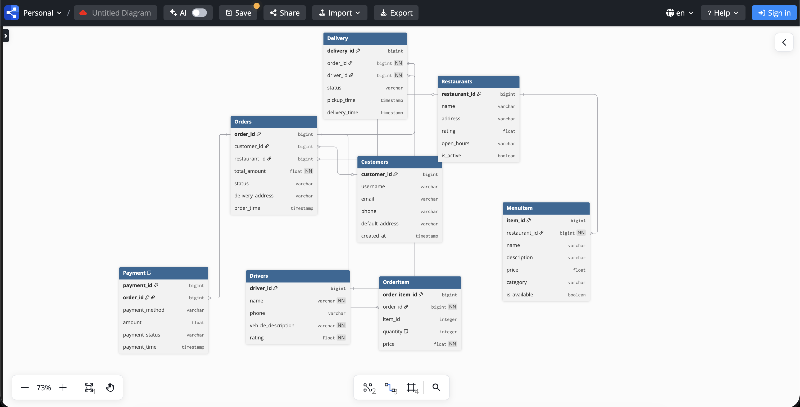
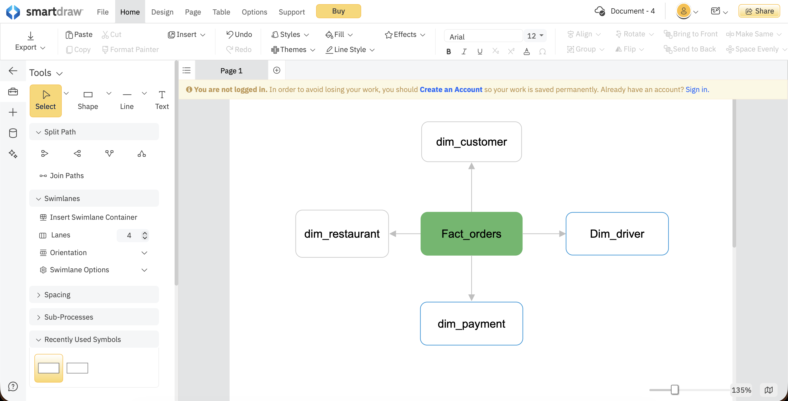

# Data Modeling Exercise

**Q** Create data modeling for a use case.

### 1. Use Case Overview

A restaurant wants to:

- Track customers, orders, and payments
- Analyze sales trends, popular dishes, and customer preferences
- Support reporting and decision-making for marketing and supply chain
- Daily, weekly, monthly sales reports

---

### 2. Conceptual Data Model

High level view that defines business entities and relations

###### Entities

- **Customer**
- **Restaurant**
- **MenuItem**
- ***Order***
- ***OrderItem***
- ***Driver***
- ***Delivery***
- ***Payment***

###### Relations

- **Customers → Orders**: `One-to-Many`  
    A customer can place multiple orders.

- **Orders → Order Items**: `One-to-Many`  
    An order can contain multiple menu items.

- **MenuItems → OrderItems**: `One-to-Many`
    Menu items can appear in multiple orders.

- **Restaurant → MenuItem**: `One-to-many`
    A restaurant has many menu items.  Restaurant offers menu items

- **Orders → Payments**: `One-to-One` or `One-to-Many`
    Usually one payment per order, but split payments are possible.

- **Order → Delivery**: `One-to-one`
    An order has one delivery.

- **Delivery → Driver**: `Many-to-one`
    A driver can handle multiple deliveries.

```cs
Overview

Customer ---> Order ---> OrderItem ---> MenuItem <--- Restaurant
Order ---> Payment
Order ---> Delivery ---> Driver
```

---

### 3. Logical Data Model

##### Customer

- customer_id (PK)
- username
- email
- phone
- default_address
- created_at

##### Restaurant

- restaurant_id (PK)
- name
- address
- rating
- open_hours

##### MenuItem

- item_id
- restaurant_id
- name
- description
- price
- category
- is_available

##### Order

- order_id (PK)
- customer_id (FK)
- restaurant_id (FK)
- total_amount
- status
- order_time

##### OrderItem

- order_item_id
- order_id
- item_id
- quantity
- price

##### Driver

- driver_id
- name
- phone
- vehicle_description
- rating

##### Delivery

- delivery_id
- order_id
- driver_id
- status
- pickup_time
- delivery_time

##### Payment

- payment_id
- order_id
- payment_method
- amount
- status
- payment_time

---

### 4. Physical Data Model

Defines how data is stored in the table

###### SQL statments

```sql
CREATE DATABASE food_delivery;

USE food_delivery;

---------------------------------------------------
-- CUSTOMER TABLE
---------------------------------------------------
CREATE TABLE customers (
    customer_id INT AUTO_INCREMENT PRIMARY KEY,
    username VARCHAR(100) NOT NULL,
    email VARCHAR(150) NOT NULL UNIQUE,
    phone VARCHAR(20),
    default_address VARCHAR(255),
    created_at TIMESTAMP DEFAULT CURRENT_TIMESTAMP
);

---------------------------------------------------
-- RESTAURANT TABLE
---------------------------------------------------
CREATE TABLE restaurants (
    restaurant_id INT AUTO_INCREMENT PRIMARY KEY,
    name VARCHAR(150) NOT NULL,
    address VARCHAR(255),
    rating DECIMAL(2,1),
    open_hours VARCHAR(255)
    is_active BOOLEAN DEFAULT TRUE
)

---------------------------------------------------
-- DRIVER TABLE
---------------------------------------------------
CREATE TABLE drivers (
    driver_id INT AUTO_INCREMENT PRIMARY KEY,
    name VARCHAR(100) NOT NULL,
    phone VARCHAR(20),
    vehicle_description VARCHAR(50),
    rating DECIMAL(2,1),
);

---------------------------------------------------
-- MENU_ITEMS TABLE
---------------------------------------------------
CREATE TABLE menu_items (
    item_id INT AUTO_INCREMENT PRIMARY KEY,
    restaurant_id INT NOT NULL,
    name VARCHAR(150) NOT NULL,
    description TEXT,
    price DECIMAL(8,2) NOT NULL,
    category VARCHAR(100),
    is_available BOOLEAN DEFAULT TRUE,

    CONSTRAINT fk_menu_restaurant
    FOREIGN KEY (restaurant_id)
    REFERENCES restaurants(restaurant_id)
);

---------------------------------------------------
-- ORDERS TABLE
---------------------------------------------------
CREATE TABLE orders (
    order_id INT AUTO_INCREMENT PRIMARY KEY,
    customer_id INT NOT NULL,
    restaurant_id INT NOT NULL,
    total_amount DECIMAL(10,2),
    status VARCHAR(50),
    delivery_address VARCHAR(255),
    order_time TIMESTAMP DEFAULT CURRENT_TIMESTAMP,

    CONSTRAINT fk_order_customer
    FOREIGN KEY (customer_id)
    REFERENCES customers(customer_id),

    CONSTRAINT fk_order_restaurant
    FOREIGN KEY (restaurant_id)
    REFERENCES restaurants(restaurant_id)
);

---------------------------------------------------
-- ORDER ITEMS TABLE
---------------------------------------------------
CREATE TABLE order_items (
    order_item_id INT AUTO_INCREMENT PRIMARY KEY,
    order_id INT NOT NULL,
    item_id INT NOT NULL,
    quantity INT NOT NULL,
    price DECIMAL(8,2),

    CONSTRAINT fk_orderitem_order
    FOREIGN KEY (order_id)
    REFERENCES orders(order_id),

    CONSTRAINT fk_orderitem_menuitem
    FOREIGN KEY (item_id)
    REFERENCES menu_items(item_id)
);

---------------------------------------------------
-- DELIVERY TABLE
---------------------------------------------------
CREATE TABLE deliveries (
    delivery_id INT AUTO_INCREMENT PRIMARY KEY,
    order_id INT UNIQUE,
    driver_id INT,
    status VARCHAR(50),
    pickup_time TIMESTAMP NULL,
    delivery_time TIMESTAMP NULL,

    CONSTRAINT fk_delivery_order
    FOREIGN KEY (order_id)
    REFERENCES orders(order_id),

    CONSTRAINT fk_delivery_driver
    FOREIGN KEY (driver_id)
    REFERENCES drivers(driver_id)
);

---------------------------------------------------
-- PAYMENT TABLE
---------------------------------------------------
CREATE TABLE payments (
    payment_id INT AUTO_INCREMENT PRIMARY KEY,
    order_id INT UNIQUE,
    payment_method VARCHAR(50),
    amount DECIMAL(10,2),
    payment_status VARCHAR(50),
    payment_time TIMESTAMP NULL,

    CONSTRAINT fk_payment_order
    FOREIGN KEY (order_id)
    REFERENCES orders(order_id)
);

---------------------------------------------------
-- INDEXES
---------------------------------------------------
CREATE INDEX idx_orders_customer
ON orders(customer_id);

CREATE INDEX idx_orders_restaurant
ON orders(restaurant_id);

CREATE INDEX idx_menu_restaurant
ON menu_items(restaurant_id);

CREATE INDEX idx_order_items_order
ON order_items(order_id);

CREATE INDEX idx_delivery_driver
ON deliveries(driver_id);
```

###### ER Diagram



### 5. Fact and Dimension tables

```sql
---------------------------------------------------
-- Fact Table
---------------------------------------------------

CREATE TABLE FactOrders (
    order_id INT PRIMARY KEY,           -- Surrogate key for fact table
    customer_id INT NOT NULL,           -- FK to Customer dimension
    order_time_id INT NOT NULL,         -- FK to Time dimension
    payment_type_id INT NOT NULL,       -- FK to Payment dimension
    total_amount DECIMAL(10, 2) NOT NULL, -- Fact measure: total order amount

    -- Foreign key constraints
    CONSTRAINT fk_customer
        FOREIGN KEY (customer_id)
        REFERENCES DimCustomer(customer_id),
    CONSTRAINT fk_time
        FOREIGN KEY (order_time_id)
        REFERENCES DimTime(time_id),
    CONSTRAINT fk_payment
        FOREIGN KEY (payment_type_id)
        REFERENCES DimPayment(payment_id)
);

---------------------------------------------------
-- ------ ---- Dimensional Table
---------------------------------------------------

CREATE TABLE dim_customer (
    customer_key INT PRIMARY KEY AUTO_INCREMENT,
    customer_id INT,
    customer_name VARCHAR(100),
    email VARCHAR(150),
    city VARCHAR(100),
);

CREATE TABLE dim_restaurant (
    restaurant_key INT PRIMARY KEY AUTO_INCREMENT,
    restaurant_id INT,
    restaurant_name VARCHAR(150),
    cuisine_type VARCHAR(100),
    city VARCHAR(100),
    rating DECIMAL(2,1)
);

CREATE TABLE dim_date (
    date_key INT PRIMARY KEY,
    full_date DATE,
    day INT,
    month INT,
    year INT,
    weekday VARCHAR(10),
    quarter INT
);

CREATE TABLE dim_payment (
    payment_key INT PRIMARY KEY AUTO_INCREMENT,
    payment_method VARCHAR(50)
);

```



### 6. Use case

- Average delivery time per restaurant:

```sql
SELECT r.name, AVG(d.delivered_time - d.pickup_time) AS avg_delivery_time
FROM fact_orders o
JOIN dim_restaurant r ON o.restaurant_id = r.restaurant_id
JOIN delivery_tracking d ON o.order_id = d.order_id
GROUP BY r.name;
```

- Daily Revenue Report

```sql
SELECT 
    t.date AS order_date,
    SUM(f.total_amount) AS daily_revenue,
    COUNT(f.order_id) AS total_orders
FROM fact_orders f
JOIN dim_time t
  ON f.order_time_id = t.time_id
WHERE f.status = 'Completed'
GROUP BY t.date
ORDER BY t.date;
```

- Revenue by Restaurant per Month

```sql
SELECT 
    r.name AS restaurant_name,
    t.year AS order_year,
    t.month AS order_month,
    SUM(f.total_amount) AS revenue
FROM fact_orders f
JOIN dim_restaurant r
  ON f.restaurant_id = r.restaurant_id
JOIN dim_time t
  ON f.order_time_id = t.time_id
WHERE f.status = 'Completed'
GROUP BY r.name, t.year, t.month
ORDER BY r.name, t.year, t.month;
```
